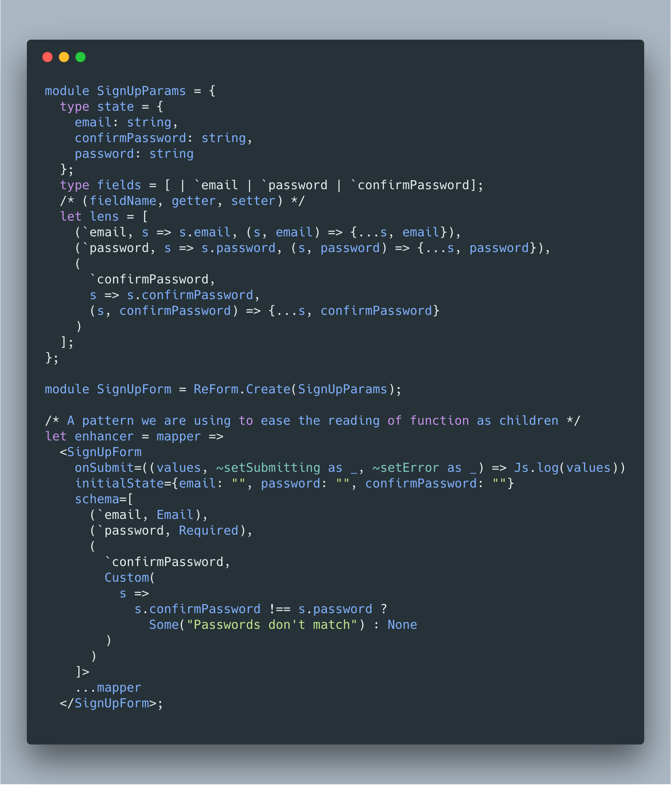

# ReForm.re

[](https://greenkeeper.io/)
[](https://travis-ci.org/Astrocoders/reform)



Reasonably making forms sound good again (pun 100% intended)

* [Installation](#installation)
* [What this is and why](#what-this-is-and-why)
* [Quick usage](#usage)
* [API](#api)
  * [Component params](#component-params)
  * [onSubmit](#onsubmit-param)
  * [onSubmitFail](#onsubmitfail-param)
  * [onFormStateChange](#onformstatechange-param)
  * [Schema](#schema)
  * [Available validators](#available-validators)
  * [reform.form](#form-paramsstate)
  * [reform.getErrorForField](#geterrorforfield-configfields--optionsstring)
  * [reform.handleSubmit](#handlesubmit-unit--unit)
  * [reform.handleChange](#handlechange-configfields-string--unit)
  * [reform.handleGlobalValidation](#handleglobalvalidation-optionstring--unit)
  * [reform.resetFormState](#resetformstate-unit--unit)
  * [reform.setFocusedField](#setfocusedfield-configfields--unit)
  * [reform.unsetFocusedField](#unsetfocusedfield-unit--unit)
  * [reform.focusedField](#focusedfield-optionconfigfields)

## Installation

```
yarn add bs-reform
```

Then add it to bsconfig.json

```
"bs-dependencies": [
 "bs-reform"
]
```

## What this is and why
Code that deals with strongly typed forms can quickly become walls of repeated text.
We created ReForm to be both deadly simple and to make forms sound good leveraging ReasonML's powerful typesytem.
Even the schemas we use are nothing more than constructors built-in in the language itself with a small size footprint.

## Usage

Checkout `demo/src/app.re` also

```reason
module SignUpParams = {
  type state = {email: string};
  type fields = [ | `email];
  /* (fieldName, getter, setter) */
  let lens = [(`email, s => s.email, (_s, email) => {email: email})];
};

module SignUpForm = ReForm.Create(SignUpParams);

let component = ReasonReact.statelessComponent("Form");

let make = _children => {
  ...component,
  render: _self =>
    <SignUpForm
      onSubmit=(({values}) => Js.log(values))
      initialState={email: ""}
      schema=[(`email, Email)]>
      ...(
           ({handleSubmit, handleChange, form, getErrorForField}) =>
             <form
               onSubmit=(ReForm.Helpers.handleDomFormSubmit(handleSubmit))>
               <label>
                 <input
                   value=form.values.email
                   onChange=(
                     ReForm.Helpers.handleDomFormChange(handleChange(`email))
                   )
                 />
               </label>
               <p>
                 (
                   getErrorForField(`email)
                   |> Belt.Option.getWithDefault(_, "")
                   |> ReasonReact.stringToElement
                 )
               </p>
               <button type_="submit">
                 ("Submit" |> ReasonReact.stringToElement)
               </button>
             </form>
         )
    </SignUpForm>,
};
```

# API
We tried to made the API as simple as possible

## Caveats

Unfortunately, due to type limitations, currently only `string` types are supported. But don't worry we'll address this issue soon.

## Component params
Each ReForm module is a ReasonReact component
```reason
/* Just regular ReasonReact */
module Form = ReForm.Create(SignUpFormParams);
```
These are the props/params it accepts:
### schema param
ReForm uses a [Schema](#schema) using idiomatic ReasonML to validate your data.

### validate param
ReForm includes a number of validators, however they can't cover every case. Writing your own validator is trivial:
```reason
let validate: SignUpForm.values => option(string) = (values) => {
  switch (values) {
    | { email: "unsafeTypeGuy@ohno.com" } when values.password === "secretThing" => Some("Can't do.")
    | _ => None
  }
}

<Form
  validate
  /* Yes! You can still use schema with it */
  schema=[(`email, Email)]
>
```

The returned valued of `validate` will set `reform.form.error`

### onSubmit param
If your data is validated then `onSubmit` will be called. This should contain your POST/mutation/whatever logic into and is triggered after `handleSubmit` is called.

```reason
let onSubmit = ({values, setError, setSubmitting, resetFormState}) => {
  Js.Promise.(
    values 
    |> convertToJS
    |> mutate
    |> then_(response => {
        switch(response##error |> Js.Null_undefined.to_opt) {
          | None =>
            setSubmitting(false);
            /* if you need to reset the form state to the initialState */
            resetFormState();
            doSomeOtherThing();
          | Some(error) =>
            setSubmitting(false);
            setError(Some("Something went wrong, try again"))
        }
      })
  )
  |> ignore
}


<Form schema onSubmit>
```

### onSubmitFail param
If the validation of your data fails then `onSubmitFail` will be called

```reason
let onSubmitFail = listOfErrors => {
  switch(Belt.List.head(listOfErrors)) {
    | Some((_field, error)) => Js.log(error)
    | None => ()
  }
}

<Form schema onSubmitFail>
```

### onFormStateChange param
This optional param will be called every time the form state changes. You might use this to lift the form state to its parent for example.

Its type is the same as the `reform.state` passed to the children.

```reason
<Form
  onFormStateChange=formState => Js.log(formState)
>
```

### i18n param
ReForm supports internationalization. If you use this then your error messages should be message keys.

## children: (YourForm.reform => ReasonReact.reactElement)
The param passed to the children has the following type:
```reason
type reform = {
  form: state,
  handleChange: (Config.fields, value) => unit,
  handleGlobalValidation: option(string) => unit,
  handleSubmit: unit => unit,
  getErrorForField: Config.fields => option(string),
  resetFormState: unit => unit,
};
```
### form: Params.state
`reform.form` contains the following
```reason
{
  /* The record containing the actual form state */
  values: Params.state,
  /* The submitting state */
  isSubmitting: bool,
  /* This is intended to store global validation error, like a submitting failure */
  error: option(string)
}
```

### handleChange: (Config.fields, string) => unit
`handleChange` takes the field and (string) value. This is an extension point that could be used in both Web and React Native

### handleSubmit: unit => unit
Triggers the submitting and makes ReForm set `reform.form.isSubmitting` to true

### getErrorForField: Config.fields => options(string)
Returns the (optional) validation error for the field in question

### handleGlobalValidation: option(string) => unit
Handles the global error value at `reform.form.error`

### resetFormState: unit => unit
Reset the form to the initial state

### setFocusedField: Config.fields => unit
Set the currently focused field. You could connect this to the onFocus of an input.

### unsetFocusedField: unit => unit
Unsets the focused field. Useful for onBlur on an input.

### focusedField: option(Config.fields)
The currently focused field. For example usable to only show the error message when the field is not focused.

## Schema

ReForm's schema consists simply of a `(fieldName: string, validator: constructor)` tuple. The first item is the name of the field and the second property is a [constructor](http://2ality.com/2017/12/variants-reasonml.html#variants-as-data-structures).

For example: 
```reason
(fieldName, validator)
```
or

```reason
(`email, Email)
```

It is passed as the first param for a `Form`: `<SignInForm schema>`

For more details, look at the [demo](https://github.com/Astrocoders/reform/tree/master/demo) to see it in action.

### Available validators

#### Custom(state => option(string))
```reason
(`password, Custom(values => values.password == "123" ? Some("Really?") : None))
```
#### Required
```reason
(`fullName, Required)
```
#### Email
```reason
(`email, Email)
```

#### Support

The authors regularly hang out at the wonderful https://discord.gg/reasonml or https://reasonml.chat so feel free to visit us there.
