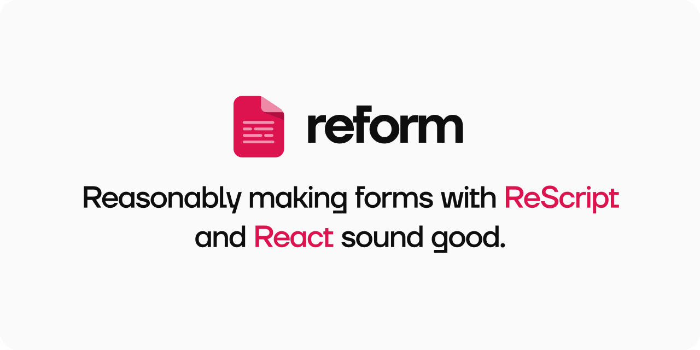

[](#contributors)

<p align="center">
   
  <br />
</p>
<p align="center">
  <a href="https://rescript-reform.netlify.app">Documentation</a> • 
  <a target="_blank" href="https://rescript-reform.netlify.app/docs/installation">Installation</a> • 
  <a target="_blank" href="https://rescript-reform.netlify.app/docs/getting-started#quick-start">Basic usage</a>
</p>
<br/>

## Installation 📦

```
yarn add @rescriptbr/reform reschema
```

Then add it to bsconfig.json

```
"bs-dependencies": [
 "@rescriptbr/reform",
 "reschema"
]
```

Then add lenses-ppx

```
yarn add lenses-ppx -D
```

And update your bsconfig.json with `ppx-flags`

```
"ppx-flags": [
 "lenses-ppx/ppx"
]
```

</details>

## Why? 💡

As you might know, you can use any existing React / JavaScript libraries with ReScript, including form libraries like Formik, react-hook-form, Final Form, since you install or create bindings for these libraries. ReForm is not a set of bindings for an existing form library, it was created from scratch to use with ReScript and React.

Code that deals with strongly typed forms can quickly become walls of repeated text. We created ReForm to be both deadly simple and to make forms sound good leveraging ReScript's powerful typesytem. Even the schemas we use are nothing more than constructors built-in in the language itself with a small size footprint.

## Features ⚡

- Hook API
- Schema API
- Type safe, `handleChange` properly infers the value of the field it is handling
- Context Provider
- Field component
- Validation strategy, OnDemand and OnChange

## Alternatives 🔥

- [Formality](https://github.com/alexfedoseev/re-formality)

## Support 🚀

🌍 We usually hang out at https://discord.gg/reasonml or https://forum.rescript-lang.org/ so feel free to ask anything there.

🇧🇷 🇵🇹  Se você é Brasileiro, Português ou fala português, você pode entrar contato através do discord do [ReasonBR](http://discord.com/invite/SSDMNYQ)

## Contributors ✨

Thanks goes to these wonderful people ([emoji key](https://allcontributors.org/docs/en/emoji-key)):

<!-- ALL-CONTRIBUTORS-LIST:START - Do not remove or modify this section -->
<!-- prettier-ignore-start -->
<!-- markdownlint-disable -->
<table>
  <tr>
    <td align="center"><a href="http://www.thomasdeconinck.fr"><br /><sub><b>Thomas Deconinck</b></sub></a><br /><a href="https://github.com/rescriptbr/reform/commits?author=DCKT" title="Documentation">📖</a> <a href="https://github.com/rescriptbr/reform/commits?author=DCKT" title="Code">💻</a></td>
    <td align="center"><a href="http://twitter.com/fakenickels"><br /><sub><b>Gabriel Rubens</b></sub></a><br /><a href="https://github.com/rescriptbr/reform/commits?author=fakenickels" title="Code">💻</a> <a href="https://github.com/rescriptbr/reform/issues?q=author%3Afakenickels" title="Bug reports">🐛</a> <a href="#ideas-fakenickels" title="Ideas, Planning, & Feedback">🤔</a> <a href="#content-fakenickels" title="Content">🖋</a> <a href="https://github.com/rescriptbr/reform/commits?author=fakenickels" title="Documentation">📖</a></td>
    <td align="center"><a href="https://twitter.com/lucasbesen"><br /><sub><b>Lucas Besen</b></sub></a><br /><a href="#maintenance-lucasbesen" title="Maintenance">🚧</a></td>
    <td align="center"><a href="https://github.com/JeffersonCarvalh0"><br /><sub><b>Jefferson Carvalho</b></sub></a><br /><a href="https://github.com/rescriptbr/reform/commits?author=JeffersonCarvalh0" title="Code">💻</a></td>
    <td align="center"><a href="https://gtluizmoratelli.itch.io"><br /><sub><b>Luiz Augusto Moratelli</b></sub></a><br /><a href="https://github.com/rescriptbr/reform/commits?author=LuizMoratelli" title="Code">💻</a></td>
    <td align="center"><a href="https://github.com/amythos"><br /><sub><b>amythos</b></sub></a><br /><a href="https://github.com/rescriptbr/reform/commits?author=amythos" title="Code">💻</a></td>
    <td align="center"><a href="http://www.lallinuorteva.fi"><br /><sub><b>Lalli Nuorteva</b></sub></a><br /><a href="https://github.com/rescriptbr/reform/issues?q=author%3Alalnuo" title="Bug reports">🐛</a></td>
  </tr>
  <tr>
    <td align="center"><a href="https://playqup.com"><br /><sub><b>Matt</b></sub></a><br /><a href="#maintenance-hew" title="Maintenance">🚧</a></td>
    <td align="center"><a href="https://github.com/kyldvs"><br /><sub><b>Kyle Davis</b></sub></a><br /><a href="https://github.com/rescriptbr/reform/pulls?q=is%3Apr+reviewed-by%3Akyldvs" title="Reviewed Pull Requests">👀</a></td>
    <td align="center"><a href="https://github.com/ulugbekna"><br /><sub><b>Ulugbek Abdullaev</b></sub></a><br /><a href="https://github.com/rescriptbr/reform/issues?q=author%3Aulugbekna" title="Bug reports">🐛</a></td>
    <td align="center"><a href="https://khoanguyen.me"><br /><sub><b>Khoa Nguyen</b></sub></a><br /><a href="https://github.com/rescriptbr/reform/commits?author=thangngoc89" title="Code">💻</a></td>
    <td align="center"><a href="http://medson.me"><br /><sub><b>Medson Oliveira</b></sub></a><br /><a href="https://github.com/rescriptbr/reform/commits?author=medson10" title="Code">💻</a> <a href="#ideas-medson10" title="Ideas, Planning, & Feedback">🤔</a></td>
    <td align="center"><a href="https://anabastos.me"><br /><sub><b>Ana Luiza Portello Bastos</b></sub></a><br /><a href="https://github.com/rescriptbr/reform/commits?author=anabastos" title="Documentation">📖</a></td>
    <td align="center"><a href="https://freddy03h.github.io"><br /><sub><b>Freddy Harris</b></sub></a><br /><a href="https://github.com/rescriptbr/reform/issues?q=author%3AFreddy03h" title="Bug reports">🐛</a></td>
  </tr>
  <tr>
    <td align="center"><a href="https://github.com/arthurbarroso"><br /><sub><b>arthur</b></sub></a><br /><a href="https://github.com/rescriptbr/reform/commits?author=arthurbarroso" title="Documentation">📖</a> <a href="https://github.com/rescriptbr/reform/commits?author=arthurbarroso" title="Code">💻</a></td>
    <td align="center"><a href="http://vmarcosp.dribbble.com"><br /><sub><b>Marcos Oliveira</b></sub></a><br /><a href="https://github.com/rescriptbr/reform/commits?author=vmarcosp" title="Documentation">📖</a> <a href="#design-vmarcosp" title="Design">🎨</a></td>
    <td align="center"><a href="http://cel.so"><br /><sub><b>Celso Bonutti</b></sub></a><br /><a href="https://github.com/rescriptbr/reform/commits?author=celsobonutti" title="Code">💻</a></td>
    <td align="center"><a href="https://github.com/JasoonS"><br /><sub><b>Jason Smythe</b></sub></a><br /><a href="https://github.com/rescriptbr/reform/commits?author=JasoonS" title="Code">💻</a> <a href="https://github.com/rescriptbr/reform/commits?author=JasoonS" title="Documentation">📖</a></td>
  </tr>
</table>

<!-- markdownlint-restore -->
<!-- prettier-ignore-end -->

<!-- ALL-CONTRIBUTORS-LIST:END -->

This project follows the [all-contributors](https://github.com/all-contributors/all-contributors) specification. Contributions of any kind welcome!
