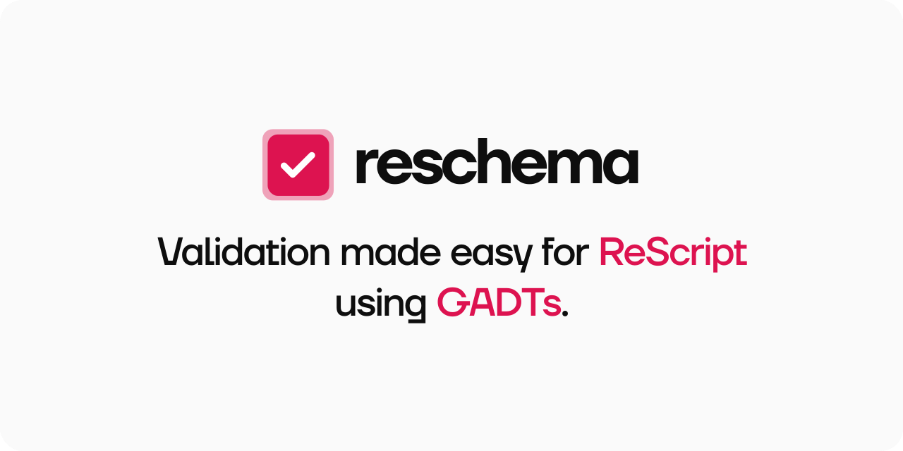

<p align="center">
   
  <br />
</p>
<p align="center">
  <a href="#what-is-this-">What is this?</a> • 
  <a href="#features-">Features</a> • 
  <a href="#installation-">Installation</a> • 
  <a href="#documentation-">Documentation</a> •
  <a target="_blank" href="https://reform-demo.rescriptbrasil.org">Live demo (with ReForm)</a>
</p>
<br/>

## What is this? 💡
ReSchema is a schema builder for ReScript. We created ReSchema to be deadly simple, leveraging ReScript's powerful typesytem.
Schemas created with ReSchema are nothing more than constructors built-in in the language itself with a small size footprint.

## Features ⚡
- Schema validation using GADT's
- Built-in validators
- Type-safe validation
- I18n support
- Regex support
- Custom validations

## Installation 📦

```sh
yarn add @rescriptbr/reschema
```
and then, add `ReSchema` as a dependency in your `bsconfig.json`
```js
{
  ...
  "bs-dependencies": [
    "@rescriptbr/reschema"
  ],
}
```

## Documentation 🔎
- [Getting Started](./docs/1-getting-started.md)
- [API Reference](./docs/2-api-reference.md)
